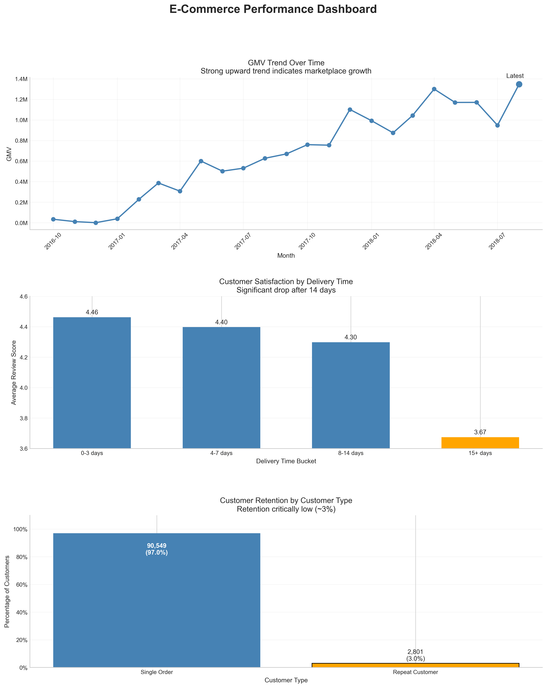

# SQL Analytics Project – E-Commerce (DuckDB)

This project analyzes a real-world e-commerce dataset to identify key growth drivers and business risks.

Key findings include:
- Strong but acquisition-driven GMV growth
- A clear delivery-time threshold impacting customer satisfaction
- Critically low customer retention (~3%)

---

## E-Commerce Performance Dashboard



This dashboard summarizes the key findings:

- Strong GMV growth over time indicates marketplace expansion  
- Customer satisfaction declines with delivery time, especially beyond 14 days  
- Customer retention is critically low (~3%), indicating strong reliance on acquisition  

---

## Business Questions

The goal of this project is to:

- Use SQL as the primary analysis tool  
- Build a structured analytics workflow (staging → metrics → insights)  
- Answer key business questions such as:
  - How is revenue distributed across sellers?
  - Does delivery time impact customer satisfaction?
  - How strong is customer retention?

---

## Dataset

The project uses the Olist e-commerce dataset, which includes:

- Orders  
- Order items  
- Customers  
- Payments  
- Reviews  
- Sellers  
- Products  

The dataset reflects real-world transactional data and enables realistic business analysis.

---

## Data Model

Key relationships:

- `orders` → 1 row per order  
- `order_items` → 1 row per item  
- `customers` → contains `customer_unique_id` (true customer identifier)  
- `reviews` → multiple reviews per order possible  

Important considerations:

- `customer_id` is not a stable identifier  
- `customer_unique_id` is used for customer-level analysis  

---

## Core Metrics

- GMV (Gross Merchandise Value)  
- Delivered Orders  
- AOV (Average Order Value)  
- Items per Order (IPO)  
- Month-over-Month (MoM) Growth  

---

## Key Insights

### Marketplace Growth

- GMV shows a consistent upward trend over time  
- Indicates strong platform growth and increasing transaction volume  

---

### Delivery Time Impact

Customer satisfaction declines as delivery time increases:

- 0–3 days → 4.46  
- 4–7 days → 4.40  
- 8–14 days → 4.30  
- 15+ days → 3.67  

A clear drop occurs beyond 14 days, indicating a critical threshold.

---

### Customer Retention

- Only ~3% of customers place more than one order  
- The majority of customers purchase only once  

This indicates a heavy reliance on customer acquisition rather than retention.

---

## Business Impact

- Identified critically low customer retention (~3%)  
- Highlighted delivery time as a key driver of customer satisfaction  
- Demonstrated strong and consistent marketplace growth  

---

## Tech Stack

- SQL (DuckDB)  
- Python (Pandas, Matplotlib)  
- VS Code  
- CSV-based data processing  

---

## Project Structure

```
sql/
  00_staging_views.sql
  01_exploration.sql
  02_core_metrics.sql
  03_advanced_analysis.sql

docs/
  01_data_overview.md
  02_data_quality.md
  03_metric_definitions.md

analysis/
  analysis.ipynb

images/
  ecommerce_dashboard.png
  gmv_over_time.png
  delivery_time_vs_review_score.png
  customer_retention.png
```

---

## How to Run

1. Open the project in VS Code  
2. Ensure DuckDB is installed  
3. Run SQL files sequentially:  
   - staging → exploration → metrics → analysis  
4. Open `analysis.ipynb` to generate visualizations  

Note: Raw data files are not included in this repository.

---

## Key Learnings

- Understanding data grain is critical for correct aggregation  
- Data modeling (e.g. customer identifiers) strongly impacts results  
- SQL alone can answer complex business questions  
- Clear metric definitions are essential for consistent reporting  